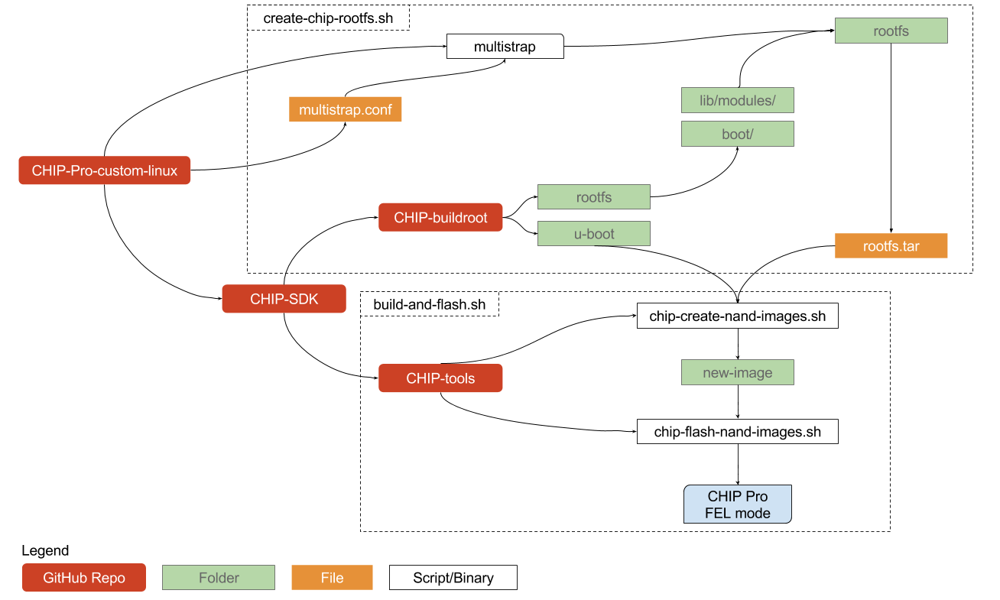

# Custom Linux for CHIP (Pro)


## Install
```bash
git clone https://github.com/msolters/chip-pro-custom-linux
cd chip-pro-custom-linux
sh setup.sh
```

## Creating a Custom rootfs
Simply provide the `multistrap` config file for your desired Linux image, and pass it to `create-rootfs` script:

```bash
sh create-chip-rootfs.sh multistrap-config-examples/debian-netutils.conf
```

This will generate a `rootfs.tar` inside the `chip-pro-custom-linux` directory.

## Synthesize Image
Next, we need to synthesize a final NAND image from the (a) bootloader (generated by `CHIP-buildroot`) and (b) our new `rootfs.tar`.  This image will then be flashed to the CHIP Pro, connected to our development machine and in FEL mode.  This script will automate all of that:

```
sh build-and-flash.sh
```
